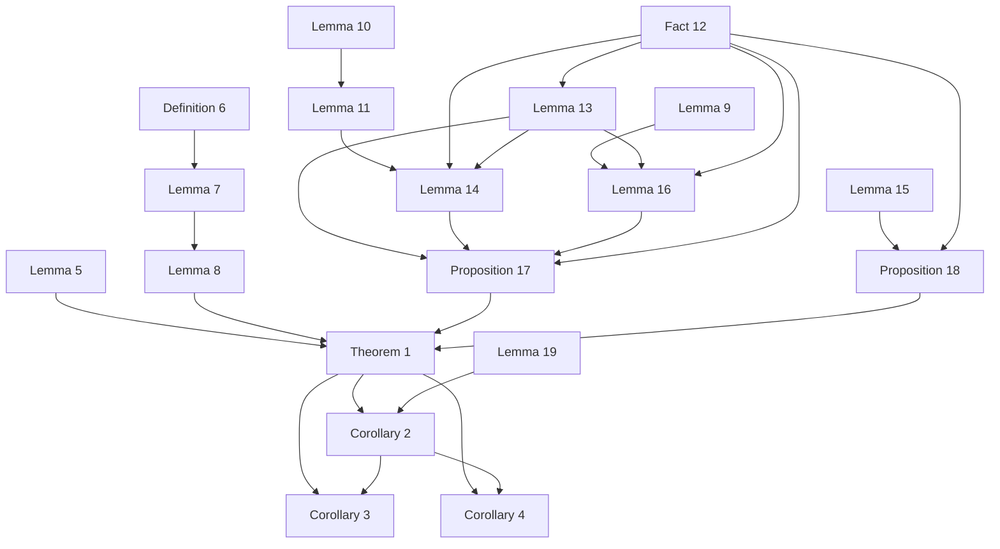
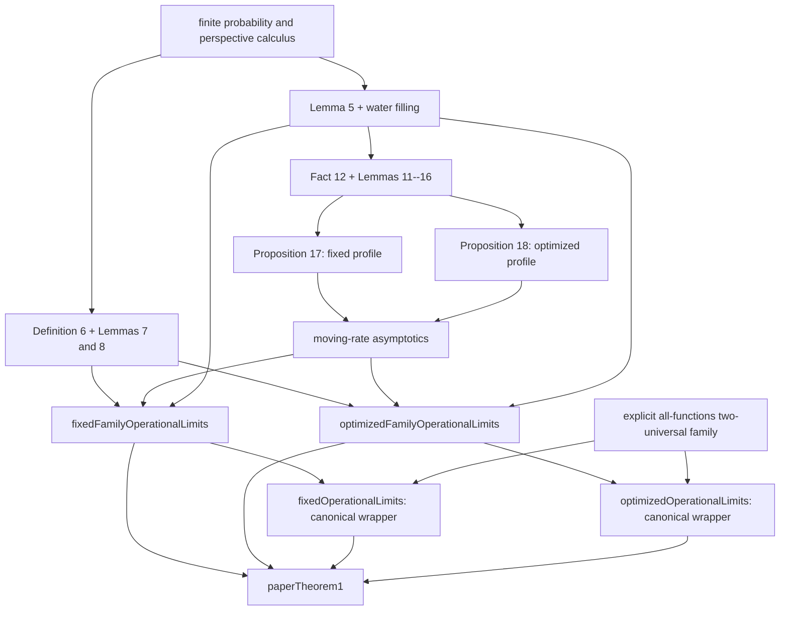
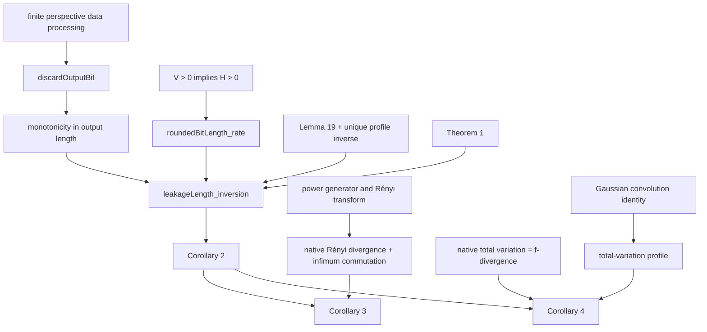
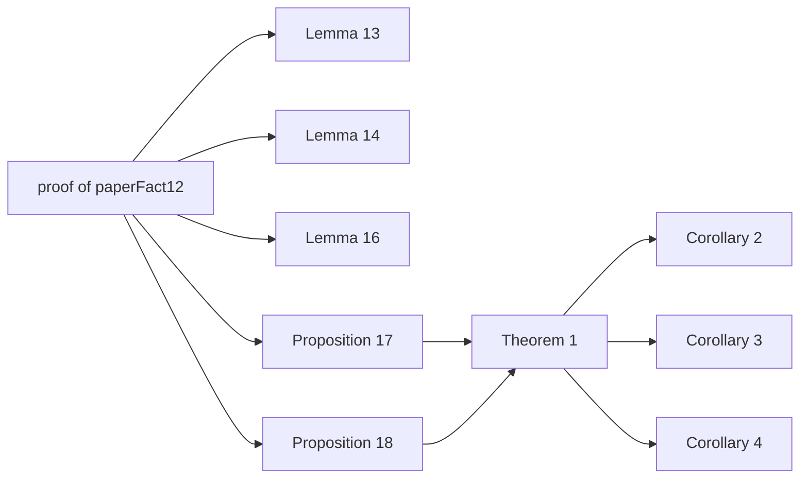

# Dependency graphs

Arrows point from a prerequisite to a statement that uses it. Unnumbered
technical lemmas are expanded in the second and third graphs.

## Numbered paper statements

Lemmas 5, 9, 10, 15, and 19 are proved directly from definitions and
mathlib. The graph records logical use, not merely module imports.

## Theorem 1: internal proof structure

The constructed all-functions family witnesses the operational infima.
The achievability clause itself is stronger: it quantifies over every
sequence of two-universal families.  The converse clause separately
quantifies over every sequence of seeded families, without a universality
assumption.

## Fixed-error inversions and specializations

The maximum extractable length is an extended-natural supremum in
`WithTop ℕ`, so an unbounded feasible set is represented by `+∞` rather
than by an arbitrary natural default.  A strict upper leakage bracket proves
the i.i.d. feasible set bounded eventually; `Nat.sSup_mem` then supplies its
actual finite maximum.  This formally resolves the infinite case, integer
rounding, and uniformity in the manuscript's inversion argument.

## Conditional boundary

Supplying a proof of `paperFact12` makes all headline results unconditional.
No other paper fact or added hypothesis is used.
