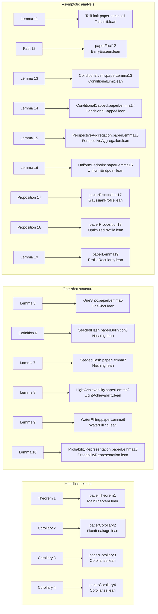
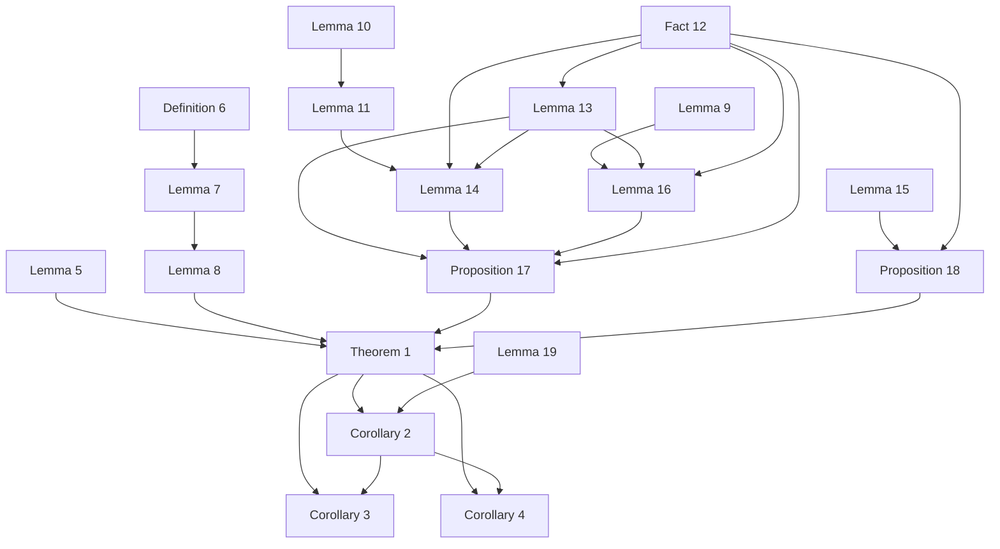

# Exact second-order classical randomness extraction

This repository contains the Lean 4 formalization accompanying the paper
*Exact Second-Order Classical Randomness Extraction Under f-Divergence
Criteria*.

The formalization covers every numbered theorem, corollary, lemma,
proposition, fact, and definition in the manuscript. It uses only mathlib.

## Build

The project is pinned to Lean and mathlib 4.33.1 by `lean-toolchain` and
`lake-manifest.json`.

```bash
lake build RandomnessExtraction
```

The aggregate import is `RandomnessExtraction.lean`. To print the kernel
axioms used by every numbered declaration, run:

```bash
lake env lean Audit.lean
```

The source snapshot copied into this export passed a 3162-job build, and the
exported Lean and configuration files were then verified byte-for-byte against
that snapshot. The build emits only linter and deprecation warnings.

## Formalization boundary

The main theorem and its corollaries take a proof of `paperFact12` as an
explicit argument. This proposition is the finite-product Berry--Esseen
estimate used in the manuscript. It is not declared as an axiom. All other
numbered statements are proved from definitions, `paperFact12`, and mathlib.

The source contains no `sorry`, `admit`, or user-defined `axiom`
declarations. `Audit.lean` reports only Lean/mathlib's standard
`propext`, `Classical.choice`, and `Quot.sound` kernel axioms.

## Paper-to-Lean correspondence

The following GitHub-native Mermaid diagram summarizes the one-to-one
correspondence. The complete table, including TeX labels and module names, is
in [`STATEMENT_MAP.md`](STATEMENT_MAP.md).



## Logical relationships

Arrows below point from a prerequisite to a numbered statement that uses it.
Expanded internal graphs for Theorem 1, the fixed-leakage inversions, and the
conditional Berry--Esseen boundary are in
[`DEPENDENCIES.md`](DEPENDENCIES.md).



## Repository layout

```text
.
├── RandomnessExtraction/      # Formalization modules
├── RandomnessExtraction.lean  # Aggregate import
├── Audit.lean                 # Kernel-axiom audit
├── STATEMENT_MAP.md           # Full paper-to-Lean correspondence
├── DEPENDENCIES.md            # Detailed dependency graphs
├── lakefile.toml              # Lake package definition
├── lake-manifest.json         # Pinned dependency manifest
├── lean-toolchain             # Pinned Lean toolchain
├── CITATION.cff               # Citation metadata
└── .gitignore
```

## Library policy

Every external import begins with `Mathlib`. The sole package dependency in
`lakefile.toml` is mathlib; no other Lean library is used.
